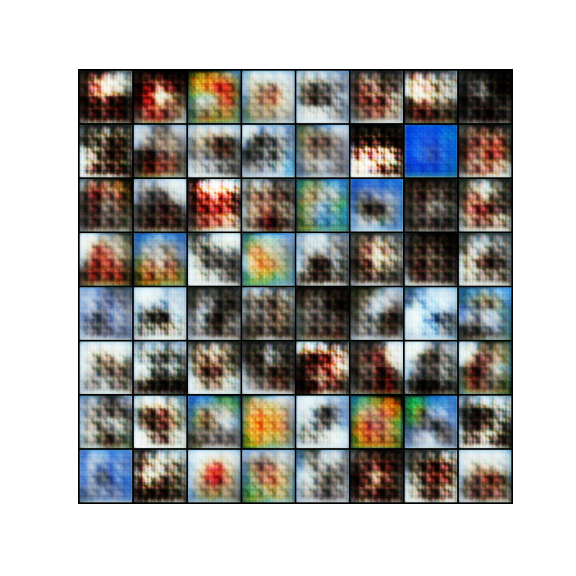
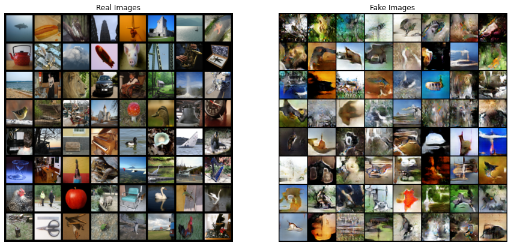
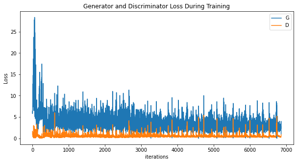

# Generating Photorealistic Images from Sketches using GANs
Initially, we planned to generate high-quality sketches from low-quality sketches. However, we soon discovered that acquiring data for this purpose would be time-consuming and outside the scope of this project. Instead, we opted to use the Sketchy database to generate photorealistic images from sketches.

# Data
We used the Sketchy database. However, we ran into a number of problems trying to use this on google Colab. The database contained over 400,000 files, which maxed out the file limit for Team Drives. Howevere, the dataset actually contained several transformed versions of the same files. With this in mind, we opted to eliminate the transformed versions of the files, transforming images as part of the data loading process instead.

# Models
While CycleGAN models are supposed to work well for unpaired data, the CycleGAN paper gave us the impression that pix2pix still tends to work better if you have paired data. We chose to try a pix2pix model and a CycleGAN model, and compare results from the two models.

We hypothesized that training a GAN on a wide variety of types of images might cause it to struggle to learn any one type of image well. In order to test this hypothesis, we created a few different models for both pix2pix and CycleGAN:
* a model using the full dataset
* an individual model for a few categories

# Initial Testing
We wanted to get a feel for what kind of images could be realistically generated using our dataset. To this end, we made a simple DCGAN based on a tutorial in the Pytorch documentation, to generate random images from just the photos in our data.

## Results

In our initial tests, we noticed the generated images exhibited a grid-like pattern. We increased the number of iterations in order to see if this pattern would go away.

After increasing the number of epochs, the grid pattern was no longer visible, and we were able to generate much better-looking random images.

Curiously, we noticed that loss did not seem to change much between 1000 and 7000 iterations, despite the significant improvement in quality of generated images.
# Sketch-to-Image results
## Pix2Pix models

### Full Dataset
In our initial results, our discriminator loss kept converging to 0, preventing the generator from learning. In order to counteract this, we increased our kernel size and added noise to the labels. Unfortunately, this did not seem to make much of a difference for training.

### Single Category

## CycleGAN model

### Full Dataset

### Single Category

# Sources
* SketchMan paper
* Sketchy paper
* Pix2Pix paper
* CycleGAN paper